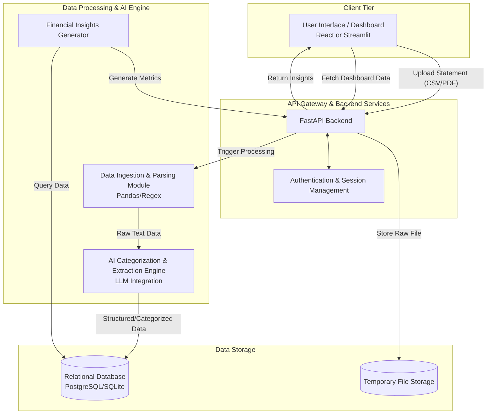

# RupeeRadar System Architecture

## 1. System Overview
RupeeRadar is an AI-powered personal finance application. The system is designed to ingest raw bank statement files, parse messy transaction data, apply AI-driven categorization, and present actionable financial insights to the user through a web-based dashboard. 

The architecture is designed to be modular, scalable, and privacy-conscious, ensuring that sensitive financial data is processed securely and efficiently.

## 2. High-Level Architecture Diagram

## 3. Core Components

### 3.1 Frontend (Client Tier)
- **Role:** Handles user interaction, file uploads, and data visualization.
- **Features:** File upload interface, spend summary dashboard, interactive charts (pie charts for categories, bar charts for monthly spend), and a list of actionable insights.
- **Recommended Tech Stack:** React.js (with Tailwind CSS and Recharts/Chart.js) for a robust UI, or Streamlit for a rapid data-centric prototype.

### 3.2 Backend API (Service Tier)
- **Role:** Orchestrates communication between the frontend, the AI engine, and the database.
- **Features:** RESTful endpoints for file upload, fetching processed transactions, retrieving insights, and user authentication.
- **Recommended Tech Stack:** Python with FastAPI (high performance, asynchronous support, excellent for Python-based ML/AI integration).

### 3.3 Data Processing & AI Engine
- **Role:** The core intelligence of the application, responsible for transforming messy data into structured information.
- **Data Ingestion Module:** Uses libraries like `pandas` (for CSV/Excel) or `PyPDF2`/`pdfplumber` (for PDFs) to extract raw text and tabular data from uploaded statements.
- **Categorization Engine:** Employs rule-based heuristics (regex) combined with an LLM (Large Language Model) to handle edge cases, ambiguous transaction descriptions, and identify recurring payments (EMIs, Subscriptions).
- **Insights Generator:** A specialized module that runs analytical queries over the structured data to calculate metrics (total spend, savings rate) and generate personalized text-based insights.

### 3.4 Data Storage
- **Role:** Securely stores user profiles, processed transaction data, and application state.
- **Relational Database:** Stores categorized transactions, user data, and pre-calculated metrics. Recommended: SQLite (for prototyping) or PostgreSQL (for production).
- **File Storage:** Temporary storage for uploaded statements during processing. Files should be deleted immediately after extraction to ensure privacy.

## 4. Data Flow

1. **Upload:** User uploads a bank statement (CSV, Excel, or PDF) via the frontend.
2. **Ingestion:** The frontend sends the file to the backend API. The file is temporarily stored.
3. **Extraction & Cleaning:** The backend triggers the parsing module to extract raw text and tabular data. Empty rows and irrelevant headers are removed.
4. **AI Processing:** 
    - The cleaned text is passed to the AI Engine.
    - The engine identifies the merchant, date, amount, and transaction type (credit/debit).
    - It categorizes the transaction (e.g., Food, Travel) and flags if it's recurring.
5. **Storage:** The structured and categorized data is saved to the database. The temporary raw file is securely deleted.
6. **Insight Generation:** The Insights module calculates key metrics based on the newly inserted data.
7. **Presentation:** The frontend fetches the structured data and insights from the API and renders the dashboard for the user.

## 5. Security & Privacy Considerations
- **Data Minimization:** Raw bank statements must be deleted immediately after data extraction.
- **Anonymization:** If an external LLM API is used for categorization, sensitive identifiers (like full account numbers) must be masked before the payload is sent.
- **Local AI (Optional):** For maximum privacy, a locally hosted Small Language Model (SLM) can be used instead of an external API for transaction categorization.
